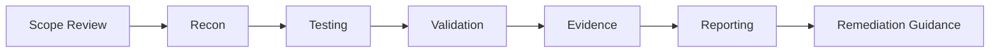

<!--
  Bavly Wagyh Kamal — Balanced Premium GitHub Profile README
  Recommended repository name: bavlybibo
  Upload this file as: README.md
-->

<div align="center">


# Cybersecurity Researcher • Bug Bounty Hunter • Security Tool Builder

<p>
  <a href="mailto:bavlywagyh@gmail.com"></a>
  <a href="https://github.com/bavlybibo"></a>
  <a href="https://www.linkedin.com/"></a>
</p>

<p>
  
  
  
  
</p>

</div>

---

## About Me

I am a **Network Security undergraduate** and **Cybersecurity Researcher** with a strong interest in **web application security, bug bounty research, penetration testing, and security tooling**.

My work is centered around finding vulnerabilities responsibly, validating impact carefully, and producing clear reports that developers and security teams can act on. I am especially interested in combining **manual testing**, **network security fundamentals**, and **automation** to build more effective cybersecurity workflows.

### Core Direction
- **Web Application Security** — XSS, IDOR, access control, API testing, authentication flows
- **Network Security** — VLANs, OSPF, routing, troubleshooting, firewall concepts
- **Security Research** — responsible disclosure, bug bounty workflows, evidence-based reporting
- **Security Engineering** — scanners, dashboards, report generation, analysis tooling

---

## Professional Snapshot

<table>
<tr>
<td width="50%">

### What I Do
- Security testing on web applications and APIs
- Bug bounty vulnerability research
- Professional reporting and remediation guidance
- Security automation with Python
- Network design and troubleshooting projects

</td>
<td width="50%">

### What I Value
- Clear technical reasoning
- Responsible and scoped testing
- Low-noise, high-confidence findings
- Practical reporting
- Continuous learning and research depth

</td>
</tr>
</table>

---

## Current Focus

```text
Web Security      → XSS, IDOR, access control, authentication and session flows
Network Security  → Segmentation, routing, OSPF, traffic analysis, secure design
Tooling           → Python-based scanners, dashboards, reporting systems
Research Style    → Recon → Validation → Evidence → Reporting → Remediation
```

---

## Selected Projects

### Advanced XSS Vulnerability Scanner
An ongoing project focused on building a more capable XSS testing workflow with deeper validation and better reporting.

**Highlights**
- Reflected XSS detection
- DOM-based XSS analysis
- Context-aware testing
- Intelligent payload generation
- Fuzzing and WAF-aware probing
- Selenium-based dynamic validation
- Structured JSON / HTML reporting

---

### HoneyPro — IoT Honeypot & Threat Telemetry Platform
A lab-focused project for collecting and analyzing malicious interactions against IoT-style services.

**Highlights**
- ESP32-based honeypot concept
- Multi-service listeners
- MQTT event collection
- Python / Flask dashboard
- Threat scoring and timeline view
- Exportable reports

---

### Multi-VLAN Network with Inter-VLAN Routing using OSPF
A networking project focused on architecture, segmentation, routing, and troubleshooting.

**Highlights**
- VLAN segmentation
- Inter-VLAN routing
- OSPF configuration
- Secure design mindset
- Troubleshooting and validation

---

### Phishing Simulation Lab
A safe awareness-focused project designed to evaluate user behavior and improve defensive practices.

**Highlights**
- Awareness workflow
- Safe testing environment
- Metrics and reporting
- Defensive education

---

## Experience

### Cybersecurity Researcher — Bugcrowd Submissions  
**2025 — Present**
- Perform authorized testing on web applications and APIs within published scope and rules.
- Identify and validate vulnerabilities such as XSS, IDOR, access control issues, and misconfigurations.
- Write professional reports with evidence, reproduction steps, risk explanation, and remediation advice.
- Use tools such as Burp Suite, Nmap, Wireshark, and related testing utilities.

### Network Security Training — Orange Business  
**Sep 2025 — Oct 2025**
- Gained hands-on exposure to firewall operations and enterprise security concepts.
- Worked with Fortinet and Palo Alto fundamentals.
- Learned SOC / support workflows and escalation concepts.

### IT / Networking & Security Intern — Egyptian Arab Land Bank  
**Aug 2025 — Sep 2025**
- Supported Windows setup, endpoint preparation, domain onboarding, and antivirus deployment.
- Practiced subnetting, routing, NAT, and troubleshooting.
- Covered Laravel basics and secure web development concepts.

---

## Technical Skills

### Languages & Development
<p>
  
  
  
  
  
  
  
</p>

### Security Tools
<p>
  
  
  
  
  
  
  
  
</p>

### Platforms
<p>
  
  
  
  
  
</p>

---

## Certifications & Learning

- TryHackMe — Junior Penetration Tester  
- Google Cybersecurity Certificate  
- IBM SkillsBuild — Cybersecurity Fundamentals  
- ITI — Ethical Hacking Certificate  
- ITI — Computer Networks Implementation Certificate  
- Meta — JavaScript Developer Certificate  
- Completed study track for **eLearnSecurity eJPT**
- Completed study track for **eLearnSecurity eWPT**
- Completed study track for **CCNA**

---

## Education

**Bachelor of Network Security**  
**El-Sewedy University of Technology, Egypt**  
**2023 — 2027**

---

## GitHub Statistics

<div align="center">


<br/><br/>


<br/><br/>


</div>

---

## How I Approach Security Work



I prefer a simple and disciplined methodology: understand the scope, test carefully, validate impact, collect evidence clearly, and communicate findings in a way that is useful for remediation.

---

## Languages

| Language | Level |
|---|---|
| Arabic | Native |
| English | Fluent |
| French | Beginner |

---

## Contact

- **Email:** [bavlywagyh@gmail.com](mailto:bavlywagyh@gmail.com)
- **GitHub:** [github.com/bavlybibo](https://github.com/bavlybibo)
- **LinkedIn:** Bavly Wagyh

---

<div align="center">


**Focused on web security, network defense, and building practical cybersecurity tools.**

</div>
