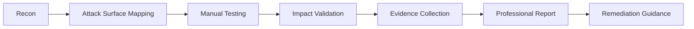

<!--
  Premium GitHub Profile README for Bavly Wagyh Kamal
  File name on GitHub must be: README.md
  Repository name must match the GitHub username exactly.
-->

<div align="center">


[](https://git.io/typing-svg)

<br/>


</div>

---

##  About Me

I am **Bavly Wagyh Kamal**, a **Network Security undergraduate** and **Cybersecurity Researcher** focused on **web application security, vulnerability research, penetration testing, and network defense**.

I work on real-world security testing through responsible bug bounty research, with practical experience in identifying and reporting vulnerabilities such as **XSS, IDOR, access control flaws, misconfigurations, and insecure application behavior**. My goal is to build high-impact cybersecurity solutions that combine **offensive security mindset**, **network engineering fundamentals**, and **automation-first thinking**.

```yaml
name: Bavly Wagyh Kamal
role: Cybersecurity Researcher
education: Bachelor of Network Security
university: El-Sewedy University of Technology
location: Egypt
focus:
  - Web Application Security
  - Bug Bounty Research
  - Penetration Testing
  - Network Security
  - Vulnerability Scanning
  - Security Automation
mindset:
  - Responsible Disclosure
  - Evidence-Based Reporting
  - Real Impact Validation
  - Continuous Learning
```

---

## 🚀 Professional Identity

<table>
<tr>
<td width="50%">

### 🛡️ Security Research
- Authorized testing through bug bounty platforms
- Web and API vulnerability analysis
- Impact-driven security reporting
- Responsible disclosure workflow
- Evidence-based exploitation validation

</td>
<td width="50%">

### 🌐 Network Security
- Routing, switching, VLANs, OSPF
- Network segmentation and troubleshooting
- Firewall/security fundamentals
- Traffic analysis and monitoring
- Secure infrastructure design

</td>
</tr>
</table>

---

## 🎯 Current Focus

<div align="center">

| Area | What I Do |
|---|---|
| **Web Security** | Testing authentication, authorization, input handling, and business logic |
| **Bug Bounty** | Finding, validating, documenting, and responsibly reporting vulnerabilities |
| **Security Automation** | Building scanners, dashboards, and security intelligence tools |
| **Network Defense** | Designing segmented networks and applying defensive controls |
| **CTF & Labs** | Practicing exploitation, recon, scripting, and forensic-style analysis |

</div>

---

## 🧠 My Security Methodology



I follow a structured workflow based on **scope verification, careful recon, manual validation, safe testing, and clean reporting**. I focus on proving real business impact without destructive behavior.

---

## 🧩 Featured Projects

### ⚡ Advanced XSS Vulnerability Scanner

An ongoing security automation project designed to detect and analyze **Reflected XSS** and **DOM-based XSS** patterns with deeper context awareness.

**Core Ideas**
- Context-aware payload testing
- Intelligent payload generation
- Fuzzing engine
- WAF-aware probing
- Selenium-based dynamic analysis
- Optional blind XSS support
- JSON/HTML-style reporting vision

**Tech Stack**


---

### 🍯 HoneyPro — IoT Honeypot & Threat Telemetry Platform

A practical IoT honeypot system built to attract, log, and analyze malicious network interactions in a controlled lab environment.

**Highlights**
- Multi-service listeners: SSH, HTTP, FTP, SMB, MySQL, Redis
- MQTT-based centralized event collection
- Python/Flask dashboard
- Threat scoring and timeline view
- Exportable security reports: HTML, CSV, PDF

**Tech Stack**


---

### 🌐 Multi-VLAN Network with Inter-VLAN Routing using OSPF

A network engineering project focused on secure segmentation, routing, and troubleshooting.

**Highlights**
- VLAN segmentation
- Inter-VLAN routing
- OSPF routing design
- Connectivity troubleshooting
- Network isolation principles

**Tech Stack**


---

### 🎣 Phishing Simulation — Awareness Lab Project

A safe awareness-focused project designed to measure user behavior and improve defensive practices.

**Highlights**
- Awareness simulation workflow
- Metrics and reporting
- Safe lab environment
- Defensive education focus

---

## 🛠️ Technical Arsenal

<div align="center">

### Programming


### Security Tools


### Platforms & Systems


</div>

---

## 🏆 Certificates & Learning Tracks

<table>
<tr>
<td width="50%">

### ✅ Completed / Earned
- TryHackMe — Junior Penetration Tester
- Google Cybersecurity Certificate
- IBM SkillsBuild — Cybersecurity Fundamentals
- ITI — Ethical Hacking Certificate
- ITI — Computer Networks Implementation Certificate
- Meta — JavaScript Developer Certificate

</td>
<td width="50%">

### 📚 Completed Study Tracks
- eLearnSecurity eJPT
- eLearnSecurity eWPT
- CCNA — Cisco Certified Network Associate
- Red Teaming / Penetration Testing path

</td>
</tr>
</table>

---

## 💼 Experience

### Cybersecurity Researcher — Bugcrowd Submissions  
**2025 — Present**

- Perform authorized security testing on web applications and APIs within published scopes.
- Identify and validate vulnerabilities including XSS, IDOR, access control issues, and misconfigurations.
- Write professional reports with reproduction steps, evidence, risk rating, and remediation recommendations.
- Use tools such as Burp Suite, Nmap, Wireshark, and related recon/testing utilities.
- Follow responsible disclosure and non-destructive testing principles.

---

## 🎓 Education

**Bachelor of Network Security**  
**El-Sewedy University of Technology, Egypt**  
**2023 — 2027**

---

## 📊 GitHub Intelligence

<div align="center">


<br/>


</div>

---

## 🧬 How I Think

> I do not just look for bugs.  
> I look for the path from weakness to real impact, then document it clearly enough that engineers can reproduce, understand, and fix it.

### My Core Principles

- **Stay within scope**
- **Validate before reporting**
- **Avoid noise and false positives**
- **Document evidence clearly**
- **Explain business impact**
- **Recommend practical remediation**
- **Keep learning every day**

---

## 🌍 Languages

| Language | Level |
|---|---|
| Arabic | Native |
| English | Fluent |
| French | Beginner |

---

## 📫 Connect With Me

<div align="center">

[](https://www.linkedin.com/)
[](mailto:bavlywagyh@gmail.com)
[](https://github.com/bavlybibo)

</div>

---

<div align="center">


### ⭐ Building security tools, breaking insecure assumptions, and learning every day.

</div>
