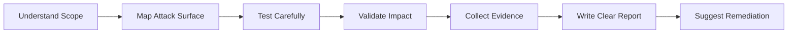

<!--
  GitHub Profile README — Bavly Wagyh Kamal
  Recommended repository name: bavlybibo
  Recommended file name: README.md
-->

<div align="center">

# Bavly Wagyh Kamal

### Cybersecurity Undergraduate · Web Security Researcher · Network Security Student

<p>
  <a href="mailto:bavlywagyh@gmail.com">
    
  </a>
  <a href="https://github.com/bavlybibo">
    
  </a>
  <a href="https://www.linkedin.com/">
    
  </a>
</p>

</div>

---

## About

I am a **cybersecurity undergraduate** specializing in **network security** and **web application security**.  
My work focuses on understanding how systems fail, validating security issues carefully, and documenting findings in a clear, responsible, and reproducible way.

I am currently building experience in:

- Web application security testing
- Bug bounty research and responsible disclosure
- Network security and traffic analysis
- Vulnerability scanning and reporting
- Security automation using Python

I care about writing reports that are useful to both security teams and developers: clear impact, clean evidence, reproducible steps, and practical remediation.

---

## Current Focus

```text
Web Security        → XSS, IDOR, access control, authentication flows, API testing
Network Security    → VLANs, routing, OSPF, firewall basics, monitoring, troubleshooting
Security Tools      → Python automation, scanners, dashboards, report generation
Research Workflow   → Recon, validation, evidence collection, responsible disclosure
```

---

## Experience

### Cybersecurity Researcher — Bugcrowd Submissions  
**2025 — Present**

- Perform authorized testing on web applications and APIs within defined program scopes.
- Analyze vulnerabilities such as XSS, IDOR, access control issues, and misconfigurations.
- Prepare structured reports with reproduction steps, evidence, risk explanation, and remediation guidance.
- Use tools such as Burp Suite, Nmap, Wireshark, and other security testing utilities.
- Follow responsible disclosure and non-destructive testing practices.

### Network Security Training — Orange Business  
**Sep 2025 — Oct 2025**

- Hands-on exposure to firewall concepts and operations using Fortinet and Palo Alto.
- Practiced SOC/support workflow concepts, escalation handling, and client interaction lifecycle.

### IT / Networking & Security Intern — Egyptian Arab Land Bank  
**Aug 2025 — Sep 2025**

- Supported Windows setup, endpoint preparation, domain onboarding, antivirus deployment, and printer configuration.
- Practiced routing fundamentals, IP addressing, subnetting, NAT, and troubleshooting.
- Covered Laravel basics and web security fundamentals.

---

## Selected Projects

### Advanced XSS Vulnerability Scanner  
An ongoing project focused on improving XSS detection with more accurate validation and better reporting.

**Main areas:**

- Reflected XSS testing
- DOM-based XSS analysis
- Payload generation and fuzzing
- Context-aware testing
- WAF-aware probing
- Selenium-based dynamic validation
- JSON / HTML reporting

---

### HoneyPro — IoT Honeypot & Threat Telemetry Platform  
A lab project for collecting and analyzing suspicious interactions against IoT-style services.

**Main areas:**

- ESP32-based honeypot concept
- Multi-service listeners
- MQTT event collection
- Python / Flask dashboard
- Threat scoring and timeline view
- Exportable reports

---

### Multi-VLAN Network with Inter-VLAN Routing using OSPF  
A networking project focused on segmentation, routing, and troubleshooting.

**Main areas:**

- VLAN design
- Inter-VLAN routing
- OSPF configuration
- IP addressing
- Network segmentation
- Connectivity troubleshooting

---

### Phishing Simulation Lab  
A safe awareness project designed to measure user behavior and improve defensive practices.

**Main areas:**

- Awareness workflow
- Safe lab testing
- Reporting and metrics
- Defensive education

---

## Technical Skills

### Programming & Web

<p>
  
  
  
  
  
  
  
</p>

### Security Tools

<p>
  
  
  
  
  
  
  
</p>

### Platforms

<p>
  
  
  
  
  
</p>

---

## Certifications & Learning

- TryHackMe — Junior Penetration Tester
- Google Cybersecurity Certificate
- IBM SkillsBuild — Cybersecurity Fundamentals
- ITI — Ethical Hacking Certificate
- ITI — Computer Networks Implementation Certificate
- Meta — JavaScript Developer Certificate
- Completed study track for eLearnSecurity eJPT
- Completed study track for eLearnSecurity eWPT
- Completed study track for CCNA

---

## Education

**Bachelor of Network Security**  
El-Sewedy University of Technology, Egypt  
**2023 — 2027**

---

## How I Approach Security Testing



My preferred workflow is simple: understand the system, test carefully, prove the issue, and communicate the risk clearly.

---

## GitHub Stats

<div align="center">


</div>

---

## Languages

| Language | Level |
|---|---|
| Arabic | Native |
| English | Fluent |
| French | Beginner |

---

## Contact

- **Email:** [bavlywagyh@gmail.com](mailto:bavlywagyh@gmail.com)
- **GitHub:** [github.com/bavlybibo](https://github.com/bavlybibo)
- **LinkedIn:** Bavly Wagyh

---

<div align="center">

_Interested in web security, network defense, and building practical security tools._

</div>
