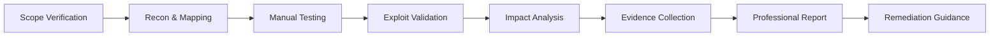
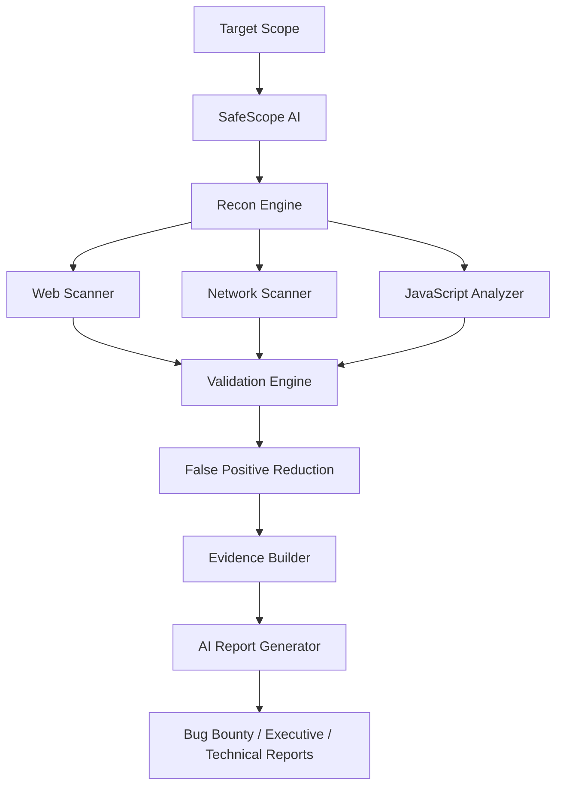
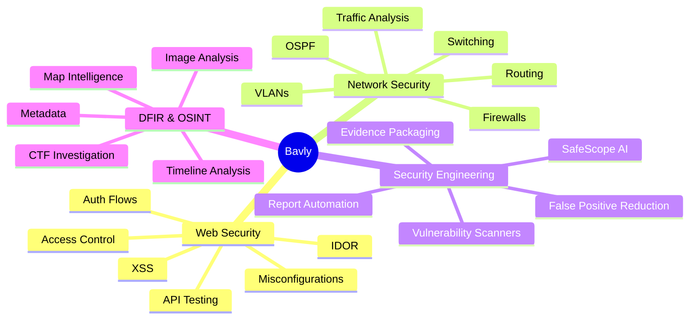
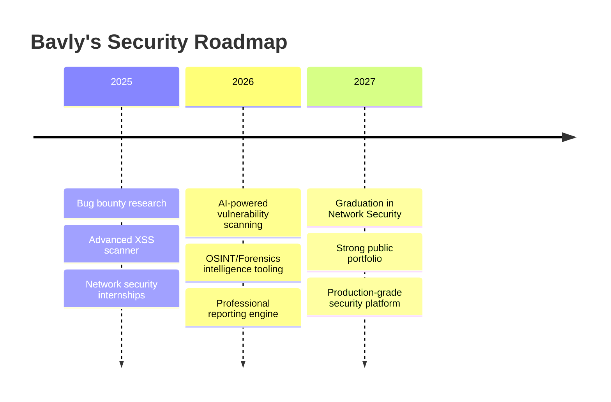

<!--
  ╔══════════════════════════════════════════════════════════════════════════════╗
  ║                 ELITE GITHUB PROFILE README — BAVLY WAGYH                 ║
  ║  Upload this file as README.md inside a repository named exactly: bavlybibo ║
  ╚══════════════════════════════════════════════════════════════════════════════╝
-->

<div align="center">


[](https://git.io/typing-svg)

<br/>


<br/><br/>

<a href="mailto:bavlywagyh@gmail.com">
  
</a>
<a href="https://www.linkedin.com/">
  
</a>
<a href="https://github.com/bavlybibo">
  
</a>

</div>

---

<div align="center">

## 🧬 Offensive Mindset. Defensive Discipline. Product Vision.

</div>

I am **Bavly Wagyh Kamal**, a **Network Security undergraduate** and **Cybersecurity Researcher** from Egypt, focused on **web application security, bug bounty research, penetration testing, network security, vulnerability scanning, and AI-assisted security automation**.

My work is built around one idea:

> **Security is not only about finding bugs — it is about proving impact, reducing false positives, and delivering evidence that engineers can trust.**

I am currently working on advanced cybersecurity tooling, including vulnerability scanning, XSS detection, OSINT/forensics intelligence, safe-scope automation, and professional reporting systems designed to make security testing more accurate, structured, and useful.

---

## ⚔️ Who Am I?

```yaml
identity:
  name: "Bavly Wagyh Kamal"
  role: "Cybersecurity Researcher | Bug Bounty Hunter | Security Tool Builder"
  education: "Bachelor of Network Security"
  university: "El-Sewedy University of Technology"
  location: "Egypt"

main_focus:
  - "Web Application Security"
  - "Bug Bounty Research"
  - "Penetration Testing"
  - "Network Security"
  - "Vulnerability Scanning"
  - "Security Automation"
  - "AI-Powered Security Tools"

research_style:
  - "Manual validation before reporting"
  - "Responsible disclosure"
  - "Scope-aware testing"
  - "Evidence-based impact"
  - "Low-noise, high-confidence findings"
  - "Professional remediation guidance"

current_direction:
  - "Building advanced vulnerability scanning systems"
  - "Improving AI-assisted security analysis"
  - "Developing professional report-generation workflows"
  - "Combining web, network, cloud, and forensic intelligence"
```

---

## 🛰️ My Cybersecurity Operating System

<div align="center">

<table>
<tr>
<td width="33%" align="center">

### 🔎 Recon
Attack surface mapping  
Endpoint discovery  
Technology fingerprinting  
Passive & active analysis  

</td>
<td width="33%" align="center">

### 🧪 Validation
Manual testing  
Payload tuning  
Access control checks  
False-positive reduction  

</td>
<td width="33%" align="center">

### 📄 Reporting
Evidence packs  
CVSS / CWE mapping  
Clear reproduction  
Actionable remediation  

</td>
</tr>
</table>

</div>



---

## 🚀 What I Am Building

<div align="center">

### 🧠 AI-Powered Vulnerability Scanner Vision

</div>

A next-generation security platform focused on **accurate vulnerability detection**, **safe automation**, and **professional reporting** — combining the spirit of advanced web scanners, network scanners, and AI-assisted security analysis.



### Planned / Active Research Directions

- **SafeScope AI** — scope-aware scan control for bug bounty programs.
- **Advanced XSS Scanner** — reflected, DOM-based, context-aware, WAF-aware, and dynamic analysis.
- **JavaScript Security Analyzer** — secrets, endpoints, dangerous functions, and risky patterns.
- **Evidence-Based Reporting** — screenshots, HTTP proof, severity, remediation, and clean export.
- **Historical Scan Comparison** — track what changed between scans.
- **AI Report Assistant** — turn findings into professional reports with technical clarity.
- **Forensics / OSINT Tooling** — image intelligence, map/location clues, metadata, and CTF-ready analysis.
- **Network + Web Unified Scanning** — one workflow for broader security visibility.

---

## 🧩 Featured Projects

<div align="center">

| Project | Category | What It Does |
|---|---|---|
| **Advanced XSS Vulnerability Scanner** | Web Security | Reflected/DOM XSS testing, context analysis, fuzzing, WAF-aware probing, Selenium-based dynamic analysis |
| **HoneyPro — IoT Honeypot Platform** | IoT / Threat Telemetry | ESP32 + Python dashboard for malicious interaction logging, MQTT telemetry, threat scoring, and reports |
| **Multi-VLAN OSPF Network** | Network Engineering | VLAN segmentation, inter-VLAN routing, OSPF design, and secure network troubleshooting |
| **Phishing Simulation Lab** | Security Awareness | Safe phishing-awareness workflow with metrics and defensive reporting |
| **GeoTrace / Forensics Intelligence Direction** | OSINT / DFIR | Image clues, metadata, map intelligence, CTF-style investigation, and evidence reporting |
| **WiGuard / Packet Tracer Intelligence Direction** | Network Security | Packet Tracer topology extraction, policy validation, topology intelligence, and professional reporting |

</div>

---

## 🔥 Project Deep Dives

### ⚡ Advanced XSS Vulnerability Scanner

A security automation project focused on detecting and validating XSS with higher accuracy and deeper analysis.

**Target Capabilities**
- Reflected XSS detection
- DOM-based XSS analysis
- Context-aware payload generation
- Intelligent fuzzing engine
- WAF detection and evasion-aware testing
- Selenium-based browser validation
- Optional blind XSS workflow
- JSON / HTML reporting
- Evidence-focused vulnerability output

**Why it matters:**  
XSS scanners often create noise. My goal is to build a workflow that focuses on **real execution, proof, context, and exploitability**.

---

### 🍯 HoneyPro — IoT Honeypot & Threat Telemetry Platform

An IoT security lab project designed to attract, log, and analyze suspicious activity.

**Core Features**
- ESP32-based honeypot concept
- Multi-service listeners such as SSH, HTTP, FTP, SMB, MySQL, Redis
- MQTT event collection
- Python / Flask dashboard
- Threat scoring
- Timeline view
- Exportable reports: HTML, CSV, PDF

---

### 🌐 Multi-VLAN Network with OSPF

A network infrastructure project focused on segmentation, routing, and secure architecture.

**Core Work**
- VLAN architecture
- Inter-VLAN routing
- OSPF routing
- IP addressing
- Troubleshooting
- Secure segmentation mindset

---

### 🛰️ Security Research & Bug Bounty

As a security researcher, I focus on vulnerabilities with real impact and clear reproduction.

**Research Areas**
- Authentication and session management
- Access control issues
- IDOR and broken object-level authorization
- XSS and client-side injection
- API security testing
- Misconfiguration analysis
- Token exposure and insecure flows
- Business logic weaknesses

**Reporting Style**
- Clear title and summary
- Affected endpoints
- Step-by-step reproduction
- Technical impact
- Business impact
- Evidence and screenshots
- Risk rating
- Remediation advice

---

## 🛠️ Technical Arsenal

<div align="center">

### Programming & Scripting


<br/><br/>

### Security & Testing Tools


<br/><br/>

### Systems & Platforms


</div>

---

## 🧠 Knowledge Map



---

## 🏆 Certifications & Learning

<div align="center">

<table>
<tr>
<td width="50%">

### ✅ Certificates
- TryHackMe — Junior Penetration Tester
- Google Cybersecurity Certificate
- IBM SkillsBuild — Cybersecurity Fundamentals
- ITI — Ethical Hacking
- ITI — Computer Networks Implementation
- Meta — JavaScript Developer Certificate

</td>
<td width="50%">

### 📚 Completed Study Tracks
- eLearnSecurity eJPT
- eLearnSecurity eWPT
- CCNA — Cisco Certified Network Associate
- Red Teaming / Penetration Testing path
- Web Application Security practice
- Security labs and CTF-style training

</td>
</tr>
</table>

</div>

---

## 💼 Experience

### Cybersecurity Researcher — Bugcrowd Submissions  
**2025 — Present**

- Performed authorized security testing on web applications and APIs within defined scopes.
- Identified and validated vulnerabilities such as XSS, IDOR, access control flaws, and misconfigurations.
- Wrote professional reports with reproduction steps, evidence, impact, and remediation.
- Used tools such as Burp Suite, Nmap, Wireshark, and related testing utilities.
- Followed responsible disclosure and non-destructive testing principles.

### Network Security Training — Orange Business  
**Sep 2025 — Oct 2025**

- Hands-on exposure to firewall configuration and operations.
- Worked with Fortinet and Palo Alto security concepts.
- Learned SOC / Support workflows, L1/L2 escalation, and client interaction lifecycle.

### IT / Networking & Security Intern — Egyptian Arab Land Bank  
**Aug 2025 — Sep 2025**

- Supported Windows setup, upgrades, and endpoint preparation.
- Assisted with domain onboarding, antivirus deployment, and printer configuration.
- Practiced routing, subnetting, NAT, and troubleshooting fundamentals.
- Covered Laravel basics and secure web development concepts.

---

## 🎓 Education

**Bachelor of Network Security**  
**El-Sewedy University of Technology, Egypt**  
**2023 — 2027**

---

## 📊 GitHub Intelligence

<div align="center">


<br/><br/>


<br/><br/>


</div>

---

## 🧪 My Research Philosophy

<div align="center">

<table>
<tr>
<td align="center" width="25%">

### 🧭 Scope First
Respect rules, boundaries, and responsible disclosure.

</td>
<td align="center" width="25%">

### 🎯 Impact Driven
A finding is stronger when the real-world risk is clear.

</td>
<td align="center" width="25%">

### 🧾 Evidence Based
Screenshots, requests, responses, and clean reproduction.

</td>
<td align="center" width="25%">

### 🛠️ Builder Mindset
Every bug teaches how to build better tools.

</td>
</tr>
</table>

</div>

---

## 🧰 Professional Report Structure I Follow

```text
01. Title
02. Summary
03. Scope & Target
04. Affected Endpoint / Component
05. Vulnerability Class
06. Severity & Reasoning
07. Step-by-Step Reproduction
08. Evidence
09. Technical Impact
10. Business Impact
11. Remediation
12. References / CWE / OWASP
```

---

## 🌍 Languages

<div align="center">

| Language | Level |
|---|---|
| Arabic | Native |
| English | Fluent |
| French | Beginner |

</div>

---

## 🎮 CTF & Lab Mindset

I enjoy challenges that require:

- Web exploitation
- Recon and OSINT
- Scripting and automation
- Network analysis
- Digital forensics
- Reverse engineering basics
- Creative thinking under pressure

---

## 📌 Current Roadmap



---

## 🤝 Let’s Connect

<div align="center">

<a href="mailto:bavlywagyh@gmail.com">
  
</a>
<a href="https://www.linkedin.com/">
  
</a>
<a href="https://github.com/bavlybibo">
  
</a>

</div>

---

<div align="center">

## ⚡ Final Statement

> **I am building my path as a cybersecurity researcher who does not stop at finding vulnerabilities — I aim to build tools, reports, and systems that make security testing smarter, safer, and more impactful.**

<br/>


</div>
